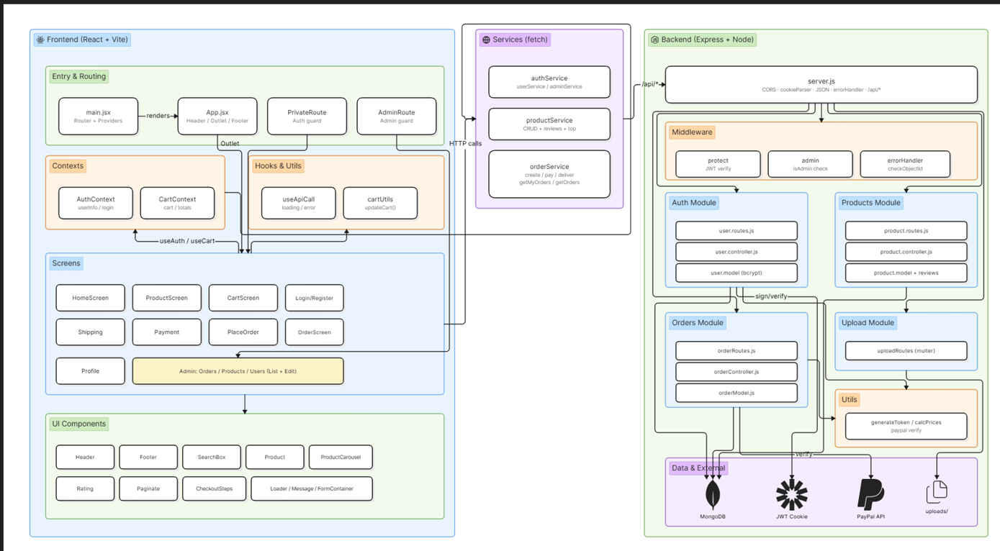
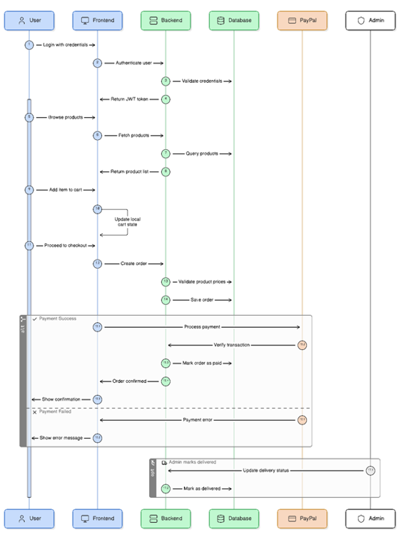

# SuperKompra: Tienda Online (Ecommerce) con React, Bootstrap, mongoDb y Express

- Carrito de compras
- Panel de administración
- Mantenimiento Usuarios, productos
- Gráficas
- Reportes
- Panel de usuarios
- autenticación de dos factores
- Pasarela de pago – paypal, etc
- Registro de Pedidos

## HERRAMIENTAS

- vite Bundler de empaquetado de las librerías usadas en el proyecto
- react Librería UI de frontend
- Bootstrap / React Bootstrap Librería de CSS
- React icons Librería de iconos adaptada a react con una gran cantidad de set de iconos
- React Router Dom Enrutador/generador de rutas para react

## ARQUITECTURA USADA

El estilo arquitectónico usado en la estructura del proyecto se conoce como Diseño Orientado a Componentes (o Component-Based Architecture), mezclado internamente con el patrón MVC (Modelo-Vista-Controlador) de manera local.
A nivel general de la industria, a este enfoque específico de carpetas también se le llama Estructura por Características o Estructura por Dominios (Feature-driven / Domain-driven structure).

- La división principal es por "Dominio" o "Funcionalidad"
  En lugar de tener una carpeta global para todos los controladores del proyecto y otra para todos los modelos (lo que sería una arquitectura puramente "por capas"), se ha agrupado los archivos según la entidad de negocio a la que pertenecen.
  SuperKompra: Tienda Online (Ecommerce) con React, Redux, Bootstrap, mongoDb y Express
  • Carrito de compras
  • Panel de administración
  o Mantenimiento Usuarios, productos
  o Gráficas
  o Reportes
  • Panel de usuarios
  o autenticación de dos factores
  o Pasarela de pago – paypal, etc
  o Registro de Pedidos

HERRAMIENTAS
vite Bundler de empaquetado de las librerías usadas en el proyecto
react Librería UI de frontend
Bootstrap / React Bootstrap Librería de CSS
React icons Librería de iconos adaptada a react con una gran cantidad de set de iconos
React Router Dom Enrutador/generador de rutas para react

ARQUITECTURA USADA
El estilo arquitectónico usado en la estructura del proyecto se conoce como Diseño Orientado a Componentes (o Component-Based Architecture), mezclado internamente con el patrón MVC (Modelo-Vista-Controlador) de manera local.
A nivel general de la industria, a este enfoque específico de carpetas también se le llama Estructura por Características o Estructura por Dominios (Feature-driven / Domain-driven structure).

1. La división principal es por "Dominio" o "Funcionalidad"
   En lugar de tener una carpeta global para todos los controladores del proyecto y otra para todos los modelos (lo que sería una arquitectura puramente "por capas"), se ha agrupado los archivos según la entidad de negocio a la que pertenecen.

- Una carpeta dedicada exclusivamente a products.
- Dentro de ella, se encuentran todos los archivos que
- le dan vida a esa funcionalidad (product.controller.js, product.model.js, product.routes.js).

2. Capas internas clásicas (MVC / Clean Architecture)
   Aunque la organización externa es por componentes, dentro de la carpeta products sigue una separación clara de responsabilidades:

- product.model.js (Capa de Datos): Define la estructura de los datos (la base de datos).
- product.controller.js (Capa de Lógica de Negocio): Maneja las peticiones, respuestas y la lógica intermedia.
- product.routes.js (Capa de Enrutamiento): Define los puntos de entrada (endpoints) de la API para ese componente.

3. Servicios y Middleware transversales
   Estructuras como middleware, config o utils quedan fuera de los componentes individuales porque son herramientas transversales (cross-cutting concerns). Es decir, son utilidades globales que cualquier componente (como products u otros futuros como users u orders) va a necesitar reutilizar.
   Ventajas de este estilo arquitectónico

- Alta Escalabilidad: Si mañana necesita agregar un módulo de "Usuarios" (users), simplemente se crea una carpeta llamada users con sus propios controladores, modelos y rutas, sin interferir con el código de products.
- Fácil Mantenimiento: Un desarrollador que necesite modificar algo relacionado con los productos sabe exactamente que todo lo que busca está concentrado en una sola carpeta.
- Bajo Acoplamiento: Los módulos son altamente independientes entre sí.
  Una carpeta dedicada exclusivamente a products.
  - Dentro de ella, se encuentran todos los archivos que le dan vida a esa funcionalidad (product.controller.js, product.model.js, product.routes.js).

* Capas internas clásicas (MVC / Clean Architecture)
  Aunque la organización externa es por componentes, dentro de la carpeta products sigue una separación clara de responsabilidades:
  - product.model.js (Capa de Datos): Define la estructura de los datos (la base de datos).
  - product.controller.js (Capa de Lógica de Negocio): Maneja las peticiones, respuestas y la lógica intermedia.
  - product.routes.js (Capa de Enrutamiento): Define los puntos de entrada (endpoints) de la API para ese componente.

- Servicios y Middleware transversales
  Estructuras como middleware, config o utils quedan fuera de los componentes individuales porque son herramientas transversales (cross-cutting concerns). Es decir, son utilidades globales que cualquier componente (como products u otros futuros como users u orders) va a necesitar reutilizar.
  Ventajas de este estilo arquitectónico
- Alta Escalabilidad: Si mañana necesita agregar un módulo de "Usuarios" (users), simplemente se crea una carpeta llamada users con sus propios controladores, modelos y rutas, sin interferir con el código de products.
- Fácil Mantenimiento: Un desarrollador que necesite modificar algo relacionado con los productos sabe exactamente que todo lo que busca está concentrado en una sola carpeta.
- Bajo Acoplamiento: Los módulos son altamente independientes entre sí.

# Diagrama de Componentes

# Diagrama de Secuencia

